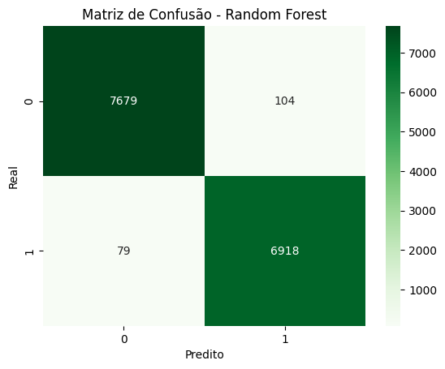
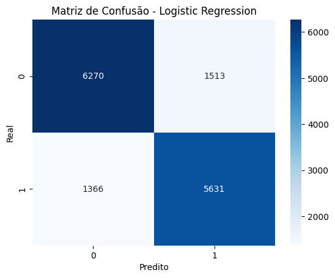

# Telco Customer Churn Analysis | Data Mining Project

This project implements a complete Data Mining workflow to analyze and predict customer churn for a telecommunications company. Following the **CRISP-DM** methodology, the study focuses on identifying patterns that lead to customer attrition and building a predictive model to support retention strategies.

## Business Objectives
The analysis aims to answer three fundamental business questions:
1. **Age Factor:** Do younger customers have a higher probability of churn than older ones?
2. **Subscription Impact:** Does the type of subscription (Basic, Standard, Premium) significantly influence churn risk?
3. **Usage Frequency:** Do "heavy users" (high usage frequency) tend to present lower churn rates?

## Tech Stack & Tools
- **Language:** Python
- **Environment:** Jupyter Notebook / Google Colab
- **Libraries:** - `Pandas` & `NumPy`: Data manipulation and cleaning.
    - `Matplotlib` & `Seaborn`: Exploratory Data Analysis (EDA).
    - `Scikit-Learn`: Machine Learning modeling and evaluation.

## Methodology (CRISP-DM)

### 1. Business Understanding
Goal: Define the impact of churn on revenue and identify key metrics for customer loyalty.

### 2. Data Understanding & EDA
We performed deep Exploratory Data Analysis to find correlations.
* **Key Insight:** Identifying which features (e.g., Support Calls, Usage Frequency) are most correlated with the target variable `Churn`.

**Visual Example:**

### 3. Data Preparation
- Handling missing values.
- Encoding categorical variables (Subscription Type, Contract, etc.).
- Feature scaling for optimal model performance.

### 4. Modeling
We implemented and compared Machine Learning models, with a focus on:
- **Random Forest Classifier**: Chosen for its robustness and ability to handle non-linear relationships.
- **Evaluation Metrics**: Focus on **Recall** (to minimize false negatives - customers we fail to identify as churners).

### 5. Evaluation & Results
The model was evaluated using Confusion Matrices and Classification Reports.
* **Result:** The model successfully identifies high-risk segments, allowing for proactive intervention.

**Model Performance:**

## Strategic Recommendations
Based on the findings, we proposed a segmented retention plan:
- **High Risk (> 0.7):** Proactive contact by the Customer Success team and special offers.
- **Medium Risk (0.4 - 0.7):** Personalized marketing campaigns and loyalty incentives.
- **Low Risk (< 0.4):** Continuous monitoring and standard service maintenance.

## Repository Structure
- `ProjetoFinal_DataMining.ipynb`: Full source code and analysis.
---
**Academic Context:** Final Project for the Data Mining course at Universidade Lusófona (LIG - 2025/26).  
**Authors:** [Amir Ajij](https://github.com/amirajij), Dhiren Lalitcumar, Nur Amade.
